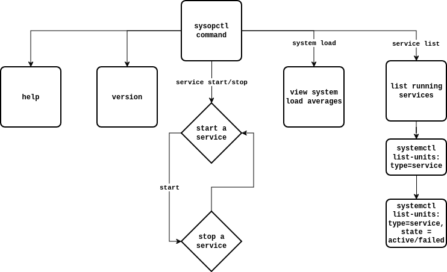

TASK 2 OF XENON STACK CODE ASSIGNMENT.

### **`sysopctl` - System Resource and Task Management**

`sysopctl` is a command-line utility for managing system services, monitoring system resources, and handling system backups.

#### **Features**
- **Service Management**:
  - `sysopctl service start <service-name>`: Start a system service.
  - `sysopctl service stop <service-name>`: Stop a system service.
  - `sysopctl service restart <service-name>`: Restart a system service.
  - `sysopctl service status <service-name>`: Check the status of a system service.
  - `sysopctl service enable <service-name>`: Enable a system service to start on boot.
  - `sysopctl service disable <service-name>`: Disable a system service from starting on boot.

- **System Monitoring**:
  - `sysopctl system load`: Display current system load averages.
  - `sysopctl disk usage`: Show disk usage statistics by partition.
  - `sysopctl process monitor`: Real-time view of system processes.

- **Log Analysis**:
  - `sysopctl log analyze`: Summary of recent critical log entries.

- **Backup System Files**:
  - `sysopctl backup <path>`: Backup system files to the specified path.

#### **Usage**
```bash
# Display help information
sysopctl --help

# Show version
sysopctl --version

# List all running services
sysopctl services list

# Start a service
sysopctl service start apache2

# Monitor system processes
sysopctl process monitor
```

#### **Installation**
Run the installation script to place `sysopctl` in `/usr/bin` and the manual page in the appropriate location:
```bash
sudo ./install.sh
```

#### **Contributing**
Please submit issues or pull requests to the [GitHub repository](https://github.com/iamb4uc/sysopctl/pulls).

#### **License**
This project is licensed under the MIT License.

For more information, refer to the manual page using `man sysopctl`.

## Flowchart

